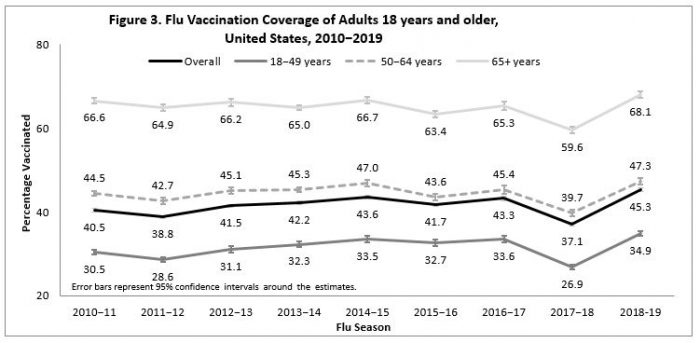
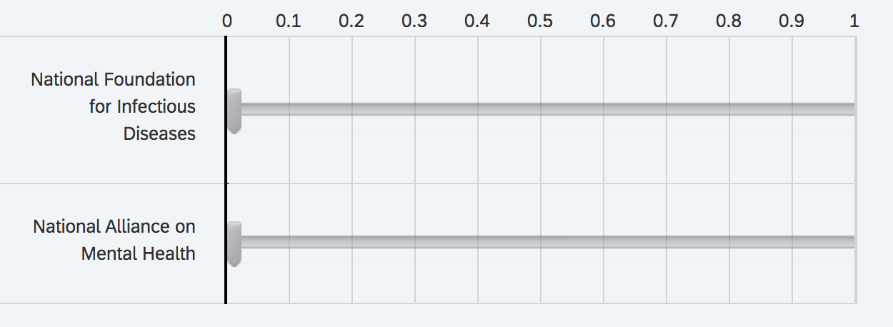
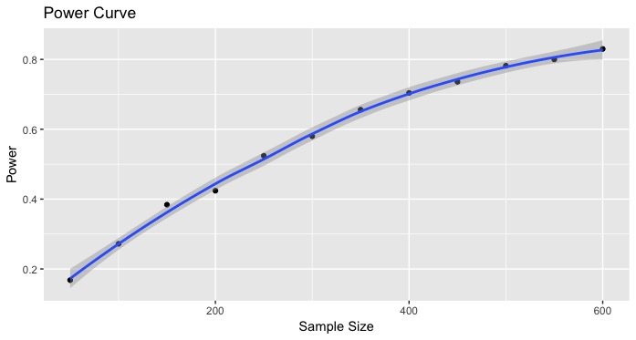
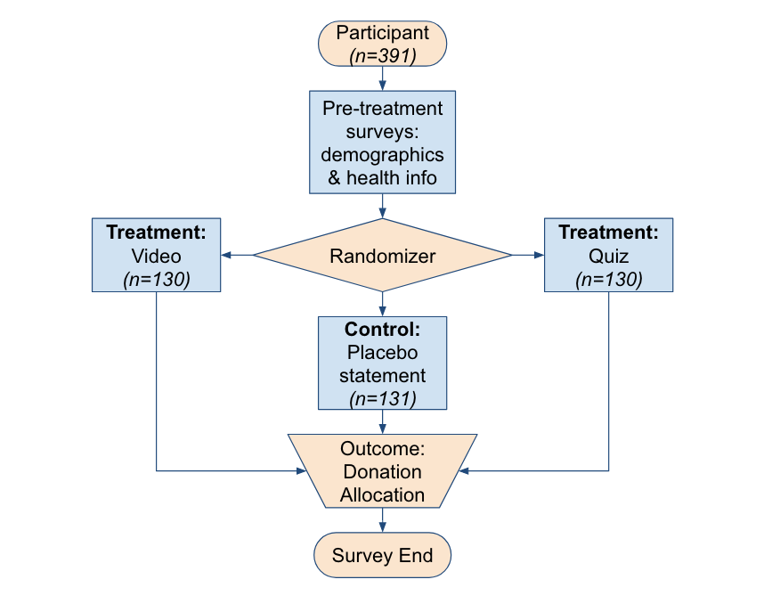

```{r setup, include=FALSE}
library(data.table)
library(magrittr)
library(ggplot2)
library(gridExtra)
library(reshape2)
library(stargazer)
library(coefplot)
library(scales)
```

```{r include=FALSE, code=readLines("./src/analysis.R")}

```
# Introduction
Influenza spreads around the globe every year, causing about 3 to 5 million cases of severe illness and up to 650,000 deaths$^1$. Approximately 20% of unvaccinated children and 10% of unvaccinated adults are infected each year$^2$. Yearly vaccinations against influenza are recommended by the World Health Organization (WHO), especially for the high risk groups - the young, the old, pregnant women, and those with other health issues. However, according to the Centers for Disease Control and Prevention (CDC), fewer than half of Americans got the flu vaccine during the 2018-2019 flu season$^3$.


\centerline{Fig. 1: Adult Flu Vaccination Coverage United States, 2010-2019, graph courtesy of the CDC}

Recent studies$^4$ have shown that many Americans do not get the flu shot due to concerns around the efficacy of the vaccine and possible side effects, while others believe they are not likely to get the flu. Cost and accessibility do not appear to be a factor, given the growth in affordable flu clinics nationwide. Other studies indicate that younger individuals typically struggle with preventive healthcare, certain ethnic groups (e.g. African Americans) are more susceptible to anti-vaccination rhetoric, and men are less likely than women to get vaccinated$^5$.

# Research Hypothesis
We hypothesize that lack of awareness is instrumental in creating this _vaccine lethargy_ and hence the goal of the experiment was guided by the following research question: **Can raising awareness around the risks of influenza to oneself and others cause more individuals to promote effective prevention of infectious diseases?**

Our hypothesis is that an individual's propensity for preventive healthcare is an important covariate in predicting experimental outcomes, and that individuals with a higher propensity for preventive healthcare will be more responsive to the intervention.

## Defining an Individual's Propensity for Preventive Healthcare
Our hypothesis of heterogeneous treatment effects was tested using relevant pre-treatment covariates that would systematically define subgroups of individuals responding differently to the intervention. We list the covariates below, and the rationale as to why they contribute to defining an individual's propensity for preventive healthcare.

* _Age_: For the 2018-19 season, flu vaccination coverage among adults between the ages of 18 and 49 years old was only 34.9%, as compared to 68.1% among adults older than 65$^3$. One theory is that healthy young adults may be less-informed and perhaps do not prioritize preventive healthcare. This motivated the evaluation of treatment effect heterogeneity for adults <40 years old and adults >=40 years old. Note that the mean age of the participants is fairly low, approximately `r round(d[, mean(age)], 2)` years old, which unfortunately means that we may be limited in our abilities to detect heterogeneous effects related to age. 

* _Health Checkup Frequency_: Individuals who prioritize regular health checkups might be more likely to respond better to the intervention. The response to the question, _"How often do you get a health checkup?"_ may also reveal individuals with chronic health conditions that require them to make more frequent health checkups (every three or six months) and it is possible that their behaviors may differ from a generally healthy population. Therefore, it would be relevant to compare the subgroups of people who have a health checkup “Once a year” and “Only when necessary”.

* _Vaccine Beliefs_: We asked the participants to answer the following question using a 11-point scale, _"Would you agree that it is important for everyone to get an influenza (flu) vaccine each year?"_. Using a Net Promoter Score\textregistered\, we found `r d[vaccine_belief %in% 0:6, .N]` _Detractors_, `r d[vaccine_belief %in% 7:8, .N]` _Passives_, and `r d[vaccine_belief %in% 9:10, .N]` _Promoters_, and we tested for heterogeneous treatment effects across a linear representation of this covariate.

In summary, we consider individuals who meet at least one (1) of the below criteria to have a high propensity for preventive healthcare:

- _Age_ >= 40 years old
- _Health Checkup Frequency_ = "Once a year"
- _Vaccine Belief_ >= 7

# Experimental Design

## Study Setting and Data Collection Mechanism(s)
Our study was administered through a Qualtrics survey and the distribution of the intervention as well as the randomization of the participants across the treatment and control groups was accomplished through the Qualtrics platform. Data indicates that participants spent approximately _2.5 minutes_, on average, to complete the survey. Raw survey data was downloaded through the Qualtrics interface (see Appendix E to download a copy of the data).

## Participants
We engaged participants through the [Prolific Platform](https://www.prolific.co/), which provides integration with Qualtrics. Adult individuals currently residing in the United States were invited to participate (we used a Prolific custom pre-screening option). Our survey was launched on Tuesday, March 17th, 2020, and we received a total of `r d[, .N]` completed survey responses.

Participants began the experiment by responding to some basic demographic questions, as well as a brief survey about their health practices and beliefs (see Appendix D for survey questions).  The purpose of these background questions was to verify the diversity of the participant pool, control for key covariates, and test for heterogeneous treatment effects.

## Intervention
Participants assigned to receive treatment were exposed to one of two different variations of the treatment in an attempt to assess if any one intervention produced different experimental outcomes (see Appendix D for CONSORT diagram). These are briefly described below.

### Treatment 1: Influenza-awareness video
Participants assigned to this treatment variation were presented with an informational, one-minute video that raises awareness about the dangers of influenza (flu) and preventive actions, including receiving a flu vaccine every year. The video is sponsored and hosted by the CDC, accessible [here](https://www.youtube.com/watch?v=MfX6xGdQco0). We enabled the collection of timing metrics that would identify non-compliers by virtue of how long participants spent on the page before navigating to the next screen. We found that, on average, participants spent 83.67 seconds on the page, and that approximately 7% of the participants (9 out of 130) did not view the entirety of the video. We decided not to categorize them as non-compliers, given that each of them received partial treatment. This highlights that in future experiments it might be advisable to introduce more rigorous controls in the survey flow, for example, highlighting the _Next_ button only after delivery of the entire message.

### Treatment 2: Influenza-awareness quiz
Participants assigned to this treatment variation were presented with a seven-question multiple-choice quiz (see Appendix D) to test the individual's knowledge about the flu, common misconceptions, and basic flu statistics. This intervention was inspired by the _Motivational Interviewing_ approach that uses an "evoke and provide" strategy to elicit behavioral change. We hoped that this treatment might be more effective, especially for individuals with a low propensity for preventive healthcare. Participants were presented with their score at the end of the quiz, and the average score was approximately `r d[treatment_quiz == 1, mean(quiz_score)]` points (out of 7). It is interesting to note that approximately 25% of the respondents believed that one can get the flu from the flu shot, which is a common misconception thought to be one of the main reasons behind low vaccination rates.

### Control: Placebo message
Participants assigned to the Control group were simply presented a placebo message (see Appendix D) in anticipation of any possible bias introduced as a result of not experiencing a delay prior to outcome measurement (versus an anticipated 1-2 minute delay for participants assigned to treatment). 

## Outcome Measures
In an ideal world, we would have been able to measure an individuals' own flu vaccination propensity as the outcome variable. However, the presence of biases like _Social Desirability Bias_ (where individuals have a tendency to over-report positive health behaviors and under-report undesirable ones) increases the likelihood of overestimating the true treatment effect. We instead decided to elicit an outcome response in the form of the participant’s willingness to make a contribution to raising infectious disease awareness in the community. 

Participants were presented with the choice of allocating a $1 donation, with the option to divide the dollar as they desired between the National Foundation of Infectious Diseases ([NFID](https://www.nfid.org/)) and the National Alliance on Mental Health ([NAMI](https://www.nami.org/)). Thus, the treatment effect was estimated by comparing the amount allocated to NFID among individuals in the treatment group(s) versus the control group. Figure 2 below shows the donation slider presented to each subject at the conclusion of the survey.  Subjects were required to allocate the full donation before proceeding to the next screen.


\centerline{Fig. 2: Outcome measurement of dividing a 1 dollar donation between NFID and NAMI}


We observed that approximately `r round(d[, mean(outcome_nfid == 0.5)]*100)`% of the respondents decided to split the donation equally between the two above causes. This highlights that there may be unobserved systemic reasons that may be related to an individuals' altruistic decisions, and in this case reflecting the uncertainty about which ways of doing good will actually be the most effective. The sum of all contributions was calculated to be $`r d[, sum(outcome_nfid)]` towards [NFID](https://www.nfid.org/ways-to-give/) and $`r d[, sum(outcome_nami)]` towards [NAMI](https://www.nami.org/get-involved/donate), and the stipulated amounts have been donated by the research team to the respective charities. 

## Randomization
We used the Qualtrics infrastructure to perform simple random assignment to allocate the participants equally across the treatment and control group(s). This guaranteed that each participant had the same probability of being treated, and therefore treatment status should be statistically independent of the participants' potential outcomes and background attributes. This is evaluated through a table of means (see Table 1) and we were unable to reject the null hypothesis of no significant difference in means for each covariate across all experimental groups, using p-values obtained from an ANOVA test. 
```{r echo=FALSE, results='asis'}
stargazer(table_of_means, table_of_means, table_of_means, table_of_means,
          type = "latex",
          no.space = TRUE,
          font.size = "footnotesize",
          header = FALSE,
          digits = 2,
          coef = c(means, list(p_values)), 
          se = c(sd, list(rep(NA, 8))),
          star.char = '', 
          omit.table.layout = '#sn',
          dep.var.labels.include = FALSE,
          dep.var.caption = 'Table of Means',
          add.lines = c('Notes:',
                        'Num observations in column headers',
                        'Standard deviations in parenthesis'),
          covariate.labels = c('Age', 'Female', 'Nonwhite', 'High School degree or equivalent', 
                               'General health index', 'Health insurance', 'Annual health checkup', 'Vaccine belief'),
          column.labels = c('Control (131)' , 'Video Treatment(130)', 'Quiz Treatment (130)', 'p-value (aov)'),
          title = 'Demographic and General Health Characteristics across Treatment and Control',
          table.placement = 'H')
```

We also ran regression models of the treatment indicator variables on all pre-treatment covariates in order to confirm that the randomization effectively balanced covariates across the treatment and control groups (see Appendix B for model summary). The results of regressing the `Video Treatment` indicator on all covariates demonstrated that no covariate coefficients were statistically significant at the 0.05 level, indicating that the difference in means for all covariates between the video treatment and control were not statistically significant. Additionally, we could not reject the null hypothesis that the covariates do not jointly predict video treatment assignment (p-value=`r round(video_cov_pvalue, 2)`). 

We ran an analogous regression for the `Quiz Treatment` indicator across all covariates.  The results of this model demonstrated that no covariate coefficients were statistically significant at the 0.05 level, and here again we could not reject the null hypothesis that the covariates do not jointly predict quiz treatment assignment (p-value=`r round(quiz_cov_pvalue, 2)`). 

These results suggest that the randomization process achieved covariate balance across the treatment and control groups.

## Power Analysis
We conducted an a priori power analysis to identify the desired sample size and ensure the power was high enough that we would likely detect the assumed effect size.  To perform the power analysis we simulated a schedule of potential outcomes under the following assumptions: (1) The distribution of contributions allocated to NFID in the control group is normally distributed with a mean of ~0.5 and a standard deviation of ~0.2, and (2) The effect of the quiz and video treatments on NFID contribution is approximately +$0.05. With the simulated data, we then investigated the relationship between the experiment's power and sample size (see Figure 4 below).  Based on the power analysis, we determined that a sample size of approximately 400 participants would yield a power of ~0.70.


\centerline{Fig. 3: Power as a function of experiment sample size}

## Pilot
```{r include=FALSE, code=readLines("./src/analysis_pilot.R")}

```
We ran a pilot study from March 4th, 2020 through March 17th, 2020, where adult participants were acquired through the research teams’ community of family and friends. We received a total of 57 survey responses. The resulting table of means (see Appendix C) is evidence that all covariates except perhaps `Vaccine Belief` are well balanced across all experimental groups. Given the small sample size, the difference in means for `Vaccine Belief` may be attributed to high sampling variability.

We did find that roughly `r round((pilot[is.na(outcome_nfid), .N]/pilot[, .N])*100, 1)`% of the respondents failed to provide an outcome measurement. As a result, we decided to incentivize the survey through a platform like Prolific, where respondents are paid a nominal fee for their participation. Additionally, we introduced stricter validation in the survey flow, to prevent missing data. 

# Results

## Exploratory Data Analysis
The gender breakdown of participants was 54% female : 43% male, which is not perfect, but does represent a large enough sample of each to provide significant insights after accounting for the not-quite equal breakdown. Racially, participants were 69% White, 9% African American, 12% Asian American, and 7% Hispanic, which compares well to national averages$^7$. Participants also covered wide range of educational backgrounds, with sizable portions all having High School, Bachelor's, or Master's Degrees. The vast majority had healthcare (86%), only slightly less than the national figure of 90%. Please see Appendix A for a summary of demographic and health distributions.

Out of the 391 participants, only 20 spent more than five minutes on the survey, and 39 spent less than one minute; both good indicators that most participants dedicated the appropriate amount of time and thus more likely they completed the survey honestly. No action was taken as a result of this observation. Only three participants seem to have mis-entered their birth years, two of whom entered their ages and another who seemingly double-pressed one digit. For our analysis, we corrected these to the presumed birth years accordingly.

The most unfortunate issue in the data was simply a result of the limitations of the sample size. In exploring key relationships tied to the `Health Checkup Frequency` variable (a particular area of interest in our analysis), it became clear that only two response levels covered a large enough sample size to be reliably significant: "Once a year" and "Only when necessary", each garnering 37% of the participants. Finally, we note that only 27% of the respondents were over 40 years old. Our initial hypothesis was that the treatment effect would be larger for older individuals compared to their younger counterparts. However, this distribution unfortunately means that we may be limited in detecting a heterogeneous effect related to age. 

## Distribution of Outcomes
Figure 4 below is a distribution of the outcome measures across the treatment (video and quiz combined) and control groups. Visual inspection of the box plots for each of the outcome measures, namely contributions to NFID and NAMI, reveal that they have very similar median values and variability across both treatment and control. However, one can observe that the interquartile range for NFID sits well below that of NAMI in the control group, and this reverses in the treatment group. _This is indicative of an apparent shift in the contribution trend (by participants) from control to treatment_.
```{r echo=FALSE, fig.width=5, fig.height=3, fig.align='center'}
d_reshaped <- melt(d, id.vars = c('id', 'treatment'), measure.vars = c('outcome_nfid', 'outcome_nami'))
d_reshaped %>% ggplot() + geom_boxplot(aes(x = factor(treatment), y = value, color = variable)) + xlab('Group') + ylab('Contribution Amount (dollars)') + ggtitle('Fig. 4: Outcome Distributions under Treatment and Control') + scale_color_manual(name = 'Cause', labels = c('NFID', 'NAMI'), values = c('#56B4E9', '#999999')) + theme(axis.title = element_text(size = 10), legend.title = element_text(size = 10), plot.title = element_text(size = 10)) + scale_x_discrete(labels=c("0" = "Control", "1" = "Treatment"))
```


## Average Treatment Estimate
Table 2 reports the difference in means treatment effect estimates obtained as a result of regressing the outcome variable of interest on the `Video Treatment` and `Quiz Treatment` indicators, followed by a second model that includes a set of pre-treatment covariates that improve the precision of the treatment effect estimate(s). We identified these covariates using a stepwise regression approach which adds covariates that give the single best improvement to the model, as measured by the p-value from an ANOVA test at every step (forward). The forward steps were halted once the inclusion of each remaining covariate no longer gave a significant result from the ANOVA test at the 0.05 level. This process revealed that `Vaccine Belief`, `Gender`, `General Health Index`, and `Age` were the controls that best predicted the outcome. The standard errors presented are heteroskedastic robust errors. 
```{r echo=FALSE, results='asis'}
stargazer(treatment, treatment_covariates,
  type = "latex",
  no.space = TRUE,
  align = TRUE,
  header = FALSE,
  font.size = "footnotesize",
  title = "Treatment effect estimates of Raising Awareness on Promotion of Preventive Healthcare",
  dep.var.labels = "Contribution to National Foundation of Infectious Diseases",
  covariate.labels = c("Video Treatment", 
                       "Quiz Treatment",
                       "Vaccine belief",
                       "Male (gender)",
                       "Non-Binary (gender)",
                       "General health index",
                       "Age"),
  se = list(sqrt(diag(treatment$vcovHC_)), 
            sqrt(diag(treatment_covariates$vcovHC_))), 
  notes = c("Robust Standard Errors"), 
  table.placement = "H")
```

The regression of the outcome variable of interest, NFID contribution amount, on the `Video Treatment` and `Quiz Treatment` indicator variables shows that the estimated average treatment effect for the `Video Treatment` is an increase of **0.9¢**, while the average treatment effect for the `Quiz Treatment` is an increase of **3.7¢**. However, both of these estimates are statistically insignificant at the 0.05 level, and thus these effects may be attributable to chance. 

Controlling for covariates, the estimated average treatment effect of the `Video Treatment` is an increase of **1.4¢** and the average treatment effect of the `Quiz Treatment` is an increase of **2.6¢**. All pre-treatment covariates have statistically significant coefficients at the 0.10 level. We also note that while the estimates did not change drastically with the inclusion of these covariates, the standard errors of both the `Video Treatment` and `Quiz Treatment` estimates decreased, re-affirming that the covariates included in the model are "good controls".  However, it is still important to note that both of the treatment estimates remained statistically insignificant at the 0.05 level.

## Are certain individuals more responsive to the intervention?
In an effort to test our hypothesis that individuals with a higher propensity for preventive healthcare will be more responsive to the intervention, Table 3 reports the heterogeneous treatment effects obtained as a result of regressing the outcome variable on the `Video Treatment` and `Quiz Treatment` variables, and interaction terms between the treatment and covariates of interest (`Age`, `Health Checkup Frequency`, and `Vaccine Belief`), in three separate models. The standard errors presented are heteroskedastic robust errors. 

Next, we investigate the statistical significance of the treatment variables along with the interaction terms.
```{r echo=FALSE, results='asis'}
stargazer(treatment_hte_age, treatment_hte_checkup, treatment_hte_belief,
  type = "latex",
  no.space = TRUE,
  align = TRUE,
  header = FALSE,
  font.size = "footnotesize",
  title = "Heterogenous Treatment effect estimates by Age, Health Checkup Frequency, and Vaccine Belief",
  dep.var.labels = "Contribution to National Foundation of Infectious Diseases",
  column.labels = c("Age (Binned)", "Health Checkup Frequency", "Vaccine Belief"),
  order = paste0("^", stargazer.vars.order , "$"),
  covariate.labels = c("Video Treatment",
                       "Quiz Treatment",
                       "Vaccine belief",
                       "Male (gender)",
                       "Non-Binary (gender)",
                       "General health index",
                       "Health checkup once a year",
                       "Health checkup once in six months",
                       "Health checkup once in three months",
                       "Health checkup never",
                       "Age",
                       "Video:Health checkup once a year",
                       "Video:Health checkup once in six months",
                       "Video:Health checkup once in three months",
                       "Video:Health checkup never",
                       "Quiz:Health checkup once a year",
                       "Quiz:Health checkup once in six months",
                       "Quiz:Health checkup once in three months",
                       "Quiz:Health checkup never",
                       "Video:Vaccine belief",
                       "Quiz:Vaccine belief",
                       "Age >= 40", 
                       "Video:Age >= 40",
                       "Quiz:Age >= 40"),
  se = list(sqrt(diag(treatment_hte_age$vcovHC_)), 
            sqrt(diag(treatment_hte_checkup$vcovHC_)),
            sqrt(diag(treatment_hte_belief$vcovHC_))), 
  notes = c("Robust Standard Errors",
            "Reference level for Age: Age <40 years", 
            "Reference level for Health Checkup Frequency: Only when necessary"),
  table.placement = "H")
```

### Treatment Effect Heterogeneity by Age
```{r echo=FALSE, fig.width=4, fig.height=3, fig.align='center'}
# Plot theme
plot_theme <- theme(axis.text.x = element_text(angle = -15, vjust = 0.5, size = 8), axis.title = element_text(size = 8), plot.title = element_text(size = 9), plot.caption = element_text(size = 9, hjust = 0)) 

coefplot(treatment_hte_age, predictors = c('treatment_video', 'treatment_quiz'), horizontal = TRUE, newNames = c(treatment_video = 'Video & Age <40 yrs', treatment_quiz = 'Quiz & Age <40 yrs', 'treatment_video:factor(age.bin)1' = 'Video & Age >=40 yrs', 'factor(age.bin)1:treatment_quiz' = 'Quiz & Age >=40 yrs'), sort='alphabetical', innerCI = FALSE) + xlab('Conditional Average Treatment Effect') + ylab('') + ggtitle('') + labs(caption = 'Fig. 5: Coefficient Plot of Heterogeneous Treatment Effects by\nAge. Each point represents estimates from an OLS regression,\nwith 95 percent confidence intervals.') + plot_theme
```
Results of the regression that evaluates the heterogeneous treatment effects of `Age` show that the estimated treatment effect of the `Video Treatment` is **2.3¢** greater for individuals >=40 years old versus those <40 years old. We hypothesized that the treatment effect would be greater for individuals >=40 years old, and thus this estimate is consistent with our hypothesis. However, the heterogeneous treatment effect is statistically insignificant. 

Conversely, the estimated treatment effect of the `Quiz Treatment` is **7.8¢** less for individuals >=40 years old versus those <40 years old. This estimate is also statistically insignificant.

### Treatment Effect Heterogeneity by Health Checkup Frequency
```{r echo=FALSE, fig.width=4, fig.height=3, fig.align='center'}
coefplot(treatment_hte_checkup, coefficients = c('treatment_video', 'treatment_quiz', 'treatment_video:checkup_freqOnce a year', 'checkup_freqOnce a year:treatment_quiz'), newNames=c(treatment_video = 'Video & If necessary', treatment_quiz = 'Quiz & If necessary', 'treatment_video:checkup_freqOnce a year' = 'Video & Once a year', 'checkup_freqOnce a year:treatment_quiz' = 'Quiz & Once a year'), horizontal = TRUE, sort="alphabetical", innerCI = FALSE) + xlab("Conditional Average Treatment Effect") + ylab('') + ggtitle('') + labs(caption = 'Fig. 6: Coefficient Plot of Heterogeneous Treatment Effects by\nHealth Checkup Frequency. Each point represents estimates\nfrom an OLS regression, with 95 percent confidence intervals.') + plot_theme
```
Results of the regression that evaluates the heterogeneous treatment effects of `Health Checkup Frequency` show some interesting relationships.  First, the estimated treatment effect of the `Video Treatment` is **-6.7¢**, but is not statistically significant at the 0.05 level. Since we have included interaction terms in this model, this coefficient represents the estimated treatment effect for individuals in the base `Health Checkup Frequency` level of "Only when necessary".  Further, the coefficient of the interaction term between the `Video Treatment` and "Once a year" `Health Checkup Frequency` is statistically significant at the 0.05 level.  This suggests that the `Video Treatment` is **16¢** greater for individuals with a higher propensity for preventive health ("Once a year" `Health Checkup Frequency`) relative to individuals with a lower propensity ("Only when necessary" `Health Checkup Frequency`). Finally, it is also interesting to note that while the conditional average treatment effect of the video is positive for individuals in the "Once a year" group, the effect is negative for individuals in the "Only when necessary" and "Once in 6 months" groups.

The treatment effect heterogeneity for the `Quiz Treatment` is statistically significant for individuals in the "Never" `Health Checkup Frequency` group at the 0.01 level.  This suggests that the quiz treatment effect for individuals who never have physician checkups is **35¢** greater than the quiz treatment effect for individuals who have checkups only when necessary. However, only 24 individuals fall within the "Never" `Health Checkup Frequency` group, so we remain skeptical that this estimate may be the result of chance.

### Treatment Effect Heterogeneity by Vaccine Belief
```{r echo=FALSE, fig.width=4, fig.height=3, fig.align='center'}
coefplot(treatment_hte_belief, predictors=c('treatment_video','treatment_quiz'), horizontal = TRUE, newNames=c(treatment_video = 'Video & Belief Level(0)', treatment_quiz = 'Quiz & Belief Level(0)', 'treatment_video:vaccine_belief' = 'Video & Belief Level(7)', 'vaccine_belief:treatment_quiz' = 'Quiz & Belief Level(7)'), sort="alphabetical", innerCI = FALSE) + xlab("Conditional Average Treatment Effect") + ylab('') + ggtitle('') + labs(caption = 'Fig. 7: Coefficient Plot of Heterogeneous Treatment Effects by\nVaccine Belief. Each point represents estimates from an OLS \nregression, with 95 percent confidence intervals.') + plot_theme
```
Results of this regression demonstrate a statistically significant heterogeneous treatment effect between the `Video Treatment` and `Vaccine Belief` variable.  The coefficient of the `Video Treatment` indicator variable is **-0.19¢**, which represents the `Video Treatment` effect for individuals with a `Vaccine Belief` of 0 (i.e. individuals who strongly oppose the vaccine).  This coefficient is statistically significant at the 0.05 level. The coefficient of the `Video Treatment` and `Vaccine Belief` interaction term suggests that for every 1-point increase in the `Vaccine Belief` scale, the treatment effect of the video increases by approximately **3¢**. This heterogeneous treatment effect is also statistically significant at the 0.05 level.  The combination of these two estimates demonstrates that the `Video Treatment` is negative for individuals with a `Vaccine Belief` under 7 and positive for individuals with a `Vaccine Belief` of 7 and above. Lastly, neither the treatment effect of the quiz nor its heterogeneous effect with `Vaccine Belief` are statistically significant.

We performed an ANOVA test for each of 3 above models against the difference in means regression model controlling for covariates.  The `Age` and `Health Checkup Frequency` models produced statistically insignificant results. However, the `Vaccine Belief` model produced a statistically significant result at the 0.01 level (p-value=`r round(hte_belief_pvalue, 4)`). This suggests that the inclusion of the `Vaccine Belief` heterogeneous treatment effects did improve overall performance from the base model.

### Adjusting for Multiple Comparisons
A practical implication of testing for multiple significant interactions is to adjust the p-value(s) accordingly to guard against false discoveries. We used the false discovery rate (`fdr`) method of correction (Benjamini & Hochberg$^6$) which is a less conservative correction than the family-wise error rate (`bonferroni`, for example). Since we are testing our hypotheses across 12 different interactions of the treatment and covariate levels (`Age`(2), `Health Checkup Freqency`(8), and `Vaccine Belief`(2)), we ran the p-values through the appropriate `p.adjust()` method and found that the previously highly significant interactions of `Quiz:Health checkup never` saw a p-value adjustment from **`r round(all_p_values['checkup_freqNever:treatment_quiz'], 4)` to `r round(adjusted_p_values['checkup_freqNever:treatment_quiz'], 4)`**, for `Video:Vaccine belief` from **`r round(all_p_values['treatment_video:vaccine_belief'], 4)` to `r round(adjusted_p_values['treatment_video:vaccine_belief'], 4)`**, and for `Video:Health checkup once a year` from **`r round(all_p_values['treatment_video:checkup_freqOnce a year'], 4)` to `r round(adjusted_p_values['treatment_video:checkup_freqOnce a year'], 4)`**. The first 2 interactions continue to be significant at the 0.1 level.

# Discussion and Conclusion
Although the two estimated treatment effects did not appear to be statistically significant, the analysis of the treatment effect heterogeneity did reveal some statistically significant effects that support our initial hypothesis. First, we note that the `Video Treatment` effect for individuals with a `Health Checkup Frequency` of "Once a year", representing individuals with a higher propensity to take preventive health measures, was **16¢** greater than individuals with a `Health Checkup Frequency` of "Only when necessary", representing individuals with a lower propensity. Furthermore, the coefficient of the interaction term between the `Vaccine Belief` covariate and `Video Treatment` variable indicated that for each 1-unit increase in `Vaccine Belief`, the `Video Treatment` effect increased by **3¢**.  The `Video Treatment` effect was positive for individuals with a `Vaccine Belief` greater than or equal to 7 and negative for individuals with a `Vaccine Belief` below 7.  The combination of these relationships directly supports our initial hypothesis that individuals with a higher propensity to take preventive health measures would have a stronger response to the treatment.

While we identified a statistically significant effect between the "Never" `Health Checkup Frequency` group and `Quiz Treatment`, we are skeptical that we can draw conclusions from this estimate.  We unfortunately did not identify any other statistically significant effect with respect to the `Quiz Treatment`.  We also did not identify a statistically significant heterogeneous treatment effect for the `Age` covariate.  However, our ability to detect this heterogeneous treatment effect may have been deterred by the skewed distribution with respect to `Age`.

It is also important to note that this study took place during the COVID-19 pandemic. While it is difficult to measure the direction of the bias stemming from the timing of the study, one possibility is that individuals with a higher propensity for preventive health measures may have had a positively biased response to treatment, given the abundance of news stories and cautions circulating through the media. 

In conclusion, the results of the above analysis ultimately demonstrate that raising awareness did cause health-conscious individuals to promote the prevention of infectious diseases.

## Acknowledgements {-}
We thank D. Alex Hughes for his guidance in designing and conducting the experiment. The experiment was funded by the UC Berkeley School of Information.

## References {-}
1. “Up to 650 000 People Die of Respiratory Diseases Linked to Seasonal Flu Each Year.” World Health Organization, World Health Organization, 14 Dec. 2017, http://www.who.int/news-room/detail/14-12-2017-up-to-650-000-people-die-of-respiratory-diseases-linked-to-seasonal-flu-each-year.
2. Somes, Mitchell P., et al. “Estimating the Annual Attack Rate of Seasonal Influenza among Unvaccinated Individuals: A Systematic Review and Meta-Analysis.” Vaccine, Elsevier, 30 Apr. 2018, http://www.sciencedirect.com/science/article/pii/S0264410X18305607?via%3Dihub.
3. “Flu Vaccination Coverage, United States, 2018–19 Influenza Season.” Centers for Disease Control and Prevention, Centers for Disease Control and Prevention, 26 Sept. 2019, http://www.cdc.gov/flu/fluvaxview/coverage-1819estimates.htm.
4. Young, Eric. “41 Percent of Americans Do Not Intend to Get a Flu Shot This Season.” NORC at the University of Chicago, 5 Dec. 2018, http://www.norc.org/NewsEventsPublications/PressReleases/Pages/41-percent-of-americans-do-not-intend-to-get-a-flu-shot.aspx.
5. Mitchell, David. “Survey Reveals Common Misconceptions About Flu, Vaccination.” AAFP Home, American Academy of Family Physicians (AAFP), 22 Jan. 2020, http://www.aafp.org/news/health-of-the-public/20200122flusurvey.html.
6. [Benjamini, Y., and Hochberg, Y. (1995). Controlling the false discovery rate: a practical and powerful approach to multiple testing](http://www.jstor.org/stable/2346101)
7. “U.S. Census Bureau QuickFacts: United States.” Census Bureau QuickFacts,
http://www.census.gov/quickfacts/fact/table/US/PST045218.

\pagebreak

# Appendix {-}

## Appendix A: Exploratory Data Analysis {-}
```{r echo=FALSE, fig.width=8, fig.height=4}
# Helper function to render the bar graph(s)
get_geom_bar <- function(var, x.label_title, color) {
  return(d %>% ggplot() + 
           geom_bar(aes(x = factor(var), y = ..prop.., group = 1), stat = 'count', fill = color) + 
           scale_y_continuous(labels = scales::percent_format(accuracy = 5L)) + 
           xlab(x.label_title) + 
           ylab(''))
}
p1 <- get_geom_bar(d$ethnicity, 'Ethnicity', 'lightblue') + scale_x_discrete(guide = guide_axis(n.dodge = 2), labels = c('Asian', 'African American', 'Hispanic or Latino', 'Other', 'White'))
p2 <- get_geom_bar(d$education, 'Education', 'lightblue') + scale_x_discrete(guide = guide_axis(n.dodge = 2), labels = c('< High School', 'High School', 'Bachelor\'s', 'Master\'s', 'Doctorate', 'Other'))
p3 <- get_geom_bar(d$age.bin, 'Age', 'lightblue') + scale_x_discrete(labels = c('<40 years', '>=40 years'))
p4 <- get_geom_bar(d$gender, 'Gender', 'lightblue')
grid.arrange(p1, p2, p3, p4, nrow = 2, top = 'Fig 8: Demographic Distributions of Participants')
```

```{r echo=FALSE, fig.width=8, fig.height=4}
p5 <- get_geom_bar(d$health_score, 'Health Score', 'lightgreen') 
p6 <- get_geom_bar(d$insurance, 'Insurance', 'lightgreen')
p7 <- get_geom_bar(d$vaccine_belief, 'Vaccine Belief', 'lightgreen')
p8 <- get_geom_bar(d$checkup_freq, 'Health Checkup Frequency', 'lightgreen') + scale_x_discrete(guide = guide_axis(n.dodge = 2),labels = c('Never', 'Only when necessary', 'Once a year', 'Once 6 months', 'Once 3 months'))
grid.arrange(p5, p6, p7, p8, nrow = 2, top = 'Fig 9: General Health Distributions of Participants')
```

## Appendix B: Models {-}

### Covariate Balance using Regression {-}
```{r echo=FALSE, results='asis'}
stargazer(covariate_video, covariate_quiz,
  type = "latex",
  no.space = TRUE,
  font.size = "footnotesize",
  align = TRUE,
  header = FALSE,
  title = "Covariate Balance Checks using Regression",
  dep.var.labels = c("Video Treatment", "Quiz Treatment"),
  covariate.labels = c("Age",
                       "Black or African American",
                       "Hispanic or Latino",
                       "Other (ethnicity)",
                       "White",
                       "Male",
                       "Non-Binary",
                       "High School degree or equivalent",
                       "Bachelor’s degree",
                       "Master’s degree",
                       "Doctorate",
                       "Other (education)",
                       "General health index",
                       "Health checkup only when necessary",
                       "Health checkup once a year",
                       "Health checkup once in six months",
                       "Health checkup once in three months",
                       "Vaccine belief"),
  se = list(sqrt(diag(covariate_video$vcovHC_)), 
            sqrt(diag(covariate_quiz$vcovHC_))), 
  notes = c("Robust Standard Errors"),
  table.placement = "H")
```

## Appendix C: Pilot Experiment {-}
```{r echo=FALSE, results='asis'}
stargazer(pilot_table_of_means, pilot_table_of_means, pilot_table_of_means, pilot_table_of_means,
          type = "latex",
          no.space = TRUE,
          font.size = "footnotesize",
          header = FALSE,
          digits = 2,
          coef = c(pilot_means, list(pilot_p_values)), 
          se = c(pilot_sd, list(rep(NA, 8))),
          star.char = '', 
          omit.table.layout = '#sn',
          dep.var.labels.include = FALSE,
          dep.var.caption = 'Table of Means',
          add.lines = c('Notes:',
                        'Num observations in column headers',
                        'Standard deviations in brackets'),
          covariate.labels = c('Age', 'Female', 'Nonwhite', 'High School degree or equivalent', 
                               'General health index', 'Health insurance', 'Annual health checkup', 'Vaccine belief'),
          column.labels = c('Control (19)' , 'Video Treatment(20)', 'Quiz Treatment (18)', 'p-value (aov)'),
          title = 'Pilot Covariate Balance Check across Treatment and Control',
          table.placement = 'H')
```

```{r echo=FALSE, fig.width=4, fig.height=3, fig.align='center'}
pilot_reshaped <- melt(pilot.complete, id.vars = c('id', 'treatment'), measure.vars = c('outcome_nfid', 'outcome_nami'))
pilot_reshaped %>% ggplot() + geom_boxplot(aes(x = factor(treatment), y = value, color = variable)) + xlab('Group') + ylab('Contribution Amount (dollars)') + ggtitle('Fig. 9: Pilot Outcome Distributions') + scale_color_manual(name = 'Cause', labels = c('NFID', 'NAMI'), values = c('#56B4E9', '#999999')) + scale_x_discrete(labels=c("0" = "Control", "1" = "Treatment")) + theme(axis.title = element_text(size = 10), legend.title = element_text(size = 10), plot.title = element_text(size = 10))
```

## Appendix D: Survey CONSORT Diagram and Questions {-}
<center>{height="800" width="600"}</center>
\centerline{Fig. 10: CONSORT Diagram tracking the flow of participants during the experiment}

### Demographic Survey {-}

1. Please specify your year of birth (free-form text)

2. What gender do you identify as?
    * Male
    * Female
    * Non-Binary
    * Prefer to self-describe
    * Prefer not to answer
  
3. Please specify your ethnicity
    * American Indian or Alaska Native
    * Asian
    * Black or African American
    * Hispanic or Latino
    * Native Hawaiian or Pacific Islander
    * White
    * Other (please specify)
    * Prefer not to answer

4. What is the highest degree or level of education you have completed?
    * Less than a high school diploma
    * High School degree or equivalent
    * Bachelor’s degree
    * Master’s degree
    * Doctorate
    * Other (please specify)
    * Prefer not to answer

### Health Survey {-}

1. How would you rate your health in general?
     * `Poor` to `Excellent` on a 0-10 scale
										
2. Do you currently have health insurance?
    * Yes
    * No
    
3. How often do you get a health checkup?
    * Once in 3 months
    * Once in 6 months
    * Once a year
    * Only when necessary
    * Never
    
4. Would you agree that it is important for everyone to get an influenza (flu) vaccine each year?
    * `Strongly Disagree` to `Strongly Agree` on a 0-10 scale
    
### Quiz Treatment {-}

1. Influenza is caused by
    * A type of bacteria
    * A virus
    * A parasitic organism
    * I don't know what causes influenza
    
2. How does the flu spread?
    * Through spoiled food
    * Through the air or by touching an infected surface
    * Through blood
    
3. What chance does a healthy person have of getting the flu during an average year?
    * Between 70 and 80 percent
    * Between 40 and 50 percent
    * Between 10 and 20 percent
    * Between 0 and 2 percent

4. How long are you contagious once you have the flu?
    * 1 day before symptoms start
    * 1 day before symptoms start and up to 1 week after becoming sick
    * 3-4 days after becoming sick
    * 1 week after becoming sick
    
5. You can get the flu from a flu shot.
    * True
    * False
    
6. What is the best time of year for a person to be vaccinated against influenza?
    * In autumn, just before the peak flu season
    * In summer, well before the next peak flu season
    * As soon as flu symptoms develop
    * Any time; it makes no difference
    
7. How many hospitalizations were caused by the flu in 2018-2019?
    * 30,000
    * 100,000
    * 500,000
    * 1,000,000
    
### Placebo Message {-}
Donating to the causes you care about not only benefits the charities themselves, but it can be deeply rewarding for you too. Millions of people give to charity on a regular basis to support causes they believe in, as well as for the positive effect it has on their own lives.

### Outcome Measurement Message {-}
How would you like us to allocate a $1 donation to the following non-profits on your behalf?

- The National Foundation for Infectious Diseases, an organization dedicated to educating the public and healthcare professionals about the burden, causes, prevention, diagnosis, and treatment of infectious diseases.
- NAMI, or National Alliance on Mental Health, an organization dedicated to improving the quality of life for people with mental illness and their families through support, education, and advocacy.
  
## Appendix E: Code and Data {-}
Code and Data can be found at the following locations in our [GitHub repository](https://github.com/adessouky/w241_finalproj):

* [Raw pilot data](https://github.com/adessouky/w241_finalproj/blob/master/data/raw/W241_Final_Project_Pilot_Raw.csv)
* [Raw experiment data](https://github.com/adessouky/w241_finalproj/blob/master/data/raw/W241_Final_Project_Raw.csv)
* [Cleaned data](https://github.com/adessouky/w241_finalproj/blob/master/data/analysis/w241_Final_Project_Analysis.csv)
* [Analysis code](https://github.com/adessouky/w241_finalproj/tree/master/src)

